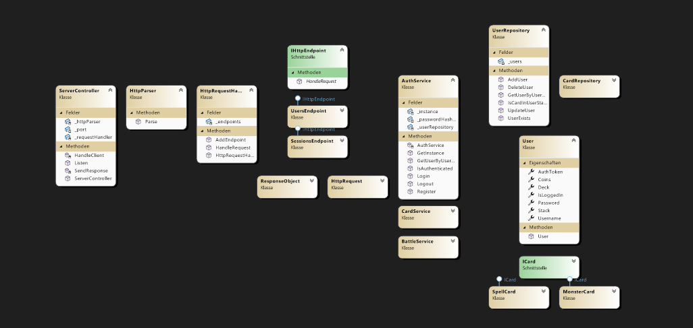

# Monster Trading Card Game

## Description
MTCG is a backend application for a trading card game. It is a RESTful API that allows users 
to create an account, buy card packages, build a deck of cards, trade them 
and battle other users. 

## Architecture
Overall, the application is structured in a layered architecture. The server is responsible for handling the HTTP requests and responses.
Moreover, the business logic is implemented in the services, which are accessed by the server.
Furthermore, the services are responsible for the game logic, such as trading cards, battling, etc.
Finally, the data access layer is implemented in the repository classes, which are used by the services to access the database.

## Design Decisions
There were difficulties in deciding how to connect the server structure with the business logic services.
Because I initially tried a bottom-up approach, I had to refactor the code to a top-down approach in order to make the server and services work together.
First, I tried to implement a singleton "service manager", which would hold all the services and provide them to the server.
However, nested singleton classes caused problems with the dependency injection, so I decided to use a simple service locator pattern.
