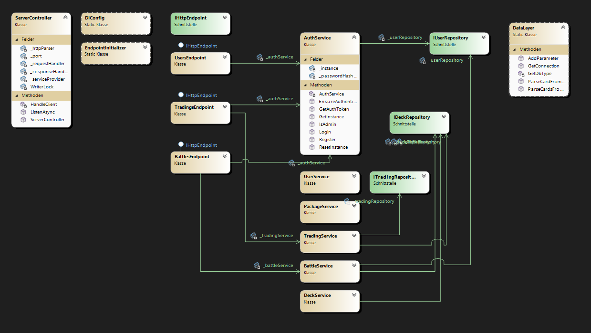
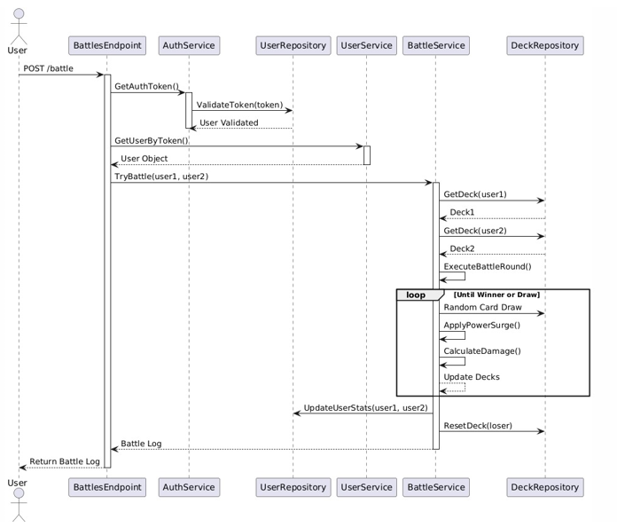
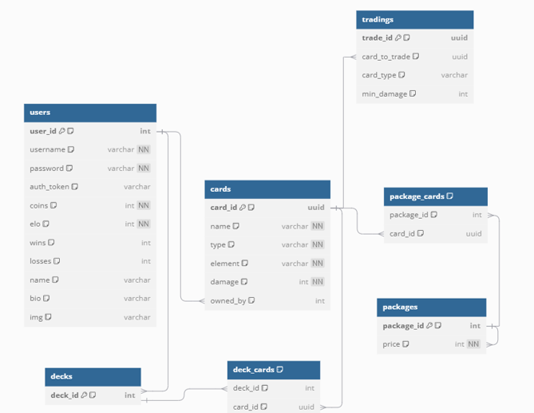

# Monster Trading Card Game (MTCG)

## Description
MTCG is a backend application for a trading card game. It provides a RESTful API that enables users to:
- Create accounts and log in securely.
- Purchase and manage card packages.
- Build and configure decks.
- Trade cards with other players.
- Battle other users with detailed game mechanics and logging.

The project is implemented in **C#** and uses **PostgreSQL** for data persistence.

---

## Architecture Overview
The project follows a **layered architecture** to ensure modularity and scalability. Below is a summary of the key layers:

### Layers and Responsibilities
1. **Server Layer**:
   - Handles HTTP requests and routes them to the appropriate services via endpoints.
   - Includes components like `Endpoints`, `Parser`, and the `ServerController`.

2. **Business Logic Layer**:
   - Implements the core game logic for battles, trading, authentication, and more.
   - Contains services like `BattleService`, `AuthService`, and `TradingService`.

3. **Repository Layer**:
   - Manages interactions with the PostgreSQL database.
   - Includes classes like `UserRepository`, `CardRepository`, and `DeckRepository`.

4. **Models Layer**:
   - Defines the application's data structures, such as `ICard`, `User`, and `TradingDeal`.

---

## Project Structure
Below is an overview of the project's directory structure:
```text
MTCG
│
├── MTCGApp.cs (Main)
│
├── BusinessLogic/
│   └── Services/ (e.g. BattleService, TradingService)
│
├── Repositories/
│   ├── Scripts/ (SQL scripts to manage the database)
│   ├── DL/ (Data Access Layer)
│   ├── Interfaces/ (Repository Interfaces)
│   └── Databases
│
├── Server/
│   ├── DI/ (Dependeny Injection Provider)
│   ├── Parser/ 
│   ├── RequestHandler/ 
│   ├── ResponseHandler/ 
│   ├── Endpoints/ (REST API routes)
│   └── ServerController.cs (Handles incoming requests)
│
├── Models/
│   └── Data models (User, Card, TradingDeal etc.)
│
├── Utilities/
│   ├── Helpers.cs (Utility methods)
│   ├── Constants.cs (Configuration constants)
│   └── Exceptions/ (Custom exceptions)
│
└── Testfiles/
    └── Scripts for testing (e.g., TestScript.bat)
```

### Class Diagram Overview
The class diagram only visualizes a part of the whole architecture. 
To be precise, it represents - from left to right - the flow between `ServerController` -> `Endpoint` -> `Service` -> `Repository`
 

### Battle Service Sequence diagram
The below diagram shows the logic behind the battle requests

 

---
## PostgreSQL 
### DB Schema

The diagram above shows a generated db diagram in DBML format created with dbdiagram.io
Note that the variable types do not match with the PostgreSQL types.
### Create docker container
Create docker container
docker run -d --name postgresdb -e POSTGRES_USER=postgres -e
POSTGRES_PASSWORD=postgres -p 5432:5432 -v pgdata:/var/lib/postgresql/data
postgres

### Reconnect to existing database
If you already have a databse inside your container and want to reconnect to it enter:

`docker exec -it postgresdb psql -U postgres`

After accessing the psql shell, type:

`\c mtcgdb`

Or to do both in one command:

`docker exec -it postgresdb psql -U postgres -d mtcgdb`

### Create new database
To create a database first authenticate in psql and then:
CREATE DATABASE mtcgdb;
Then connect to it via:

`\c mtcgdb`

Drop the database via

`DROP DATABASE mtcgdb;`

### Create tables
``` text
CREATE TABLE IF NOT EXISTS users (
    user_id SERIAL PRIMARY KEY,
    username VARCHAR(50) UNIQUE NOT NULL,
    password VARCHAR(255) NOT NULL,
    auth_token VARCHAR(255),
    coins INT DEFAULT 20 NOT NULL,
    elo INT DEFAULT 100 NOT NULL,
    wins INT DEFAULT 0,
    losses INT DEFAULT 0,
    name VARCHAR(50),
    bio VARCHAR(255),
    img VARCHAR(255)
);

CREATE TABLE IF NOT EXISTS cards (
    card_id UUID PRIMARY KEY DEFAULT gen_random_uuid(),
    name VARCHAR(100) NOT NULL,
    type VARCHAR(20) NOT NULL,
    element VARCHAR(20) NOT NULL,
    damage INT NOT NULL,
    owned_by INT,
    FOREIGN KEY (owned_by) REFERENCES users(user_id) ON DELETE SET NULL
);

CREATE TABLE IF NOT EXISTS packages (
	package_id SERIAL PRIMARY KEY,
	price INT DEFAULT 5 NOT NULL
);

CREATE TABLE IF NOT EXISTS package_cards (
    package_id INT,
    card_id UUID,
    PRIMARY KEY (package_id, card_id),
    FOREIGN KEY (package_id) REFERENCES packages(package_id) ON DELETE CASCADE,
    FOREIGN KEY (card_id) REFERENCES cards(card_id) ON DELETE CASCADE
);

CREATE TABLE IF NOT EXISTS decks (
    deck_id INT PRIMARY KEY, 
    FOREIGN KEY (deck_id) REFERENCES users(user_id) ON DELETE CASCADE
);

CREATE TABLE IF NOT EXISTS deck_cards(
    deck_id INT, 
    card_id UUID,
    PRIMARY KEY (deck_id, card_id), 
    FOREIGN KEY (deck_id) REFERENCES decks(deck_id) ON DELETE CASCADE,
    FOREIGN KEY (card_id) REFERENCES cards(card_id) ON DELETE CASCADE
);

CREATE TABLE IF NOT EXISTS tradings(
    trade_id UUID PRIMARY KEY DEFAULT gen_random_uuid(),
    card_to_trade UUID,
    card_type VARCHAR(20),
    min_damage INT,
    FOREIGN KEY (card_to_trade) REFERENCES cards(card_id) ON DELETE CASCADE
);
```
### Reset all tables via truncate
For testing purposes, it is useful to reset the tables via:
```text
DO
$$
BEGIN
   EXECUTE (
      SELECT string_agg('TRUNCATE TABLE ' || quote_ident(tablename) || ' CASCADE;', ' ')
      FROM pg_tables
      WHERE schemaname = 'public'
   );
END;
$$;
```
